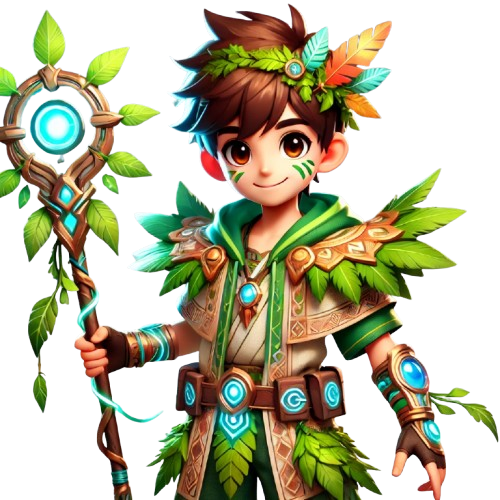

#   TechTrek

## Introduction
TechTrek is an interactive learning platform designed to guide users through the basics of computer science. It takes users on a journey through key topics such as CPU, RAM, storage, binary code, and operating systems. As users progress, they unlock new challenges that improve their efficiency and technical skills. The final goal is to earn the Tech Guru Certification, marking the user's mastery in foundational tech concepts.

- **Authors**:
  - Lamia Hamdi –
    [GitHub](https://github.com/Lamia1406) | [LinkedIn](https://www.linkedin.com/in/lamia-hamdi/)
- **Deployed site**: [TechQuest website](https://tech-quest-oq8gdg8dh-lamia1406s-projects.vercel.app/)

## Table of Contents
  - [Introduction](#introduction-)
  - [Table of Contents](#table-of-contents-)
  - [Technology Stack and Architecture](#technology-stack-and-architecture-)
## Technology Stack and Architecture
| **Category**        | **Technology/Approach**                                                                 |
|----------------------|-----------------------------------------------------------------------------------------|
| **Frontend**         | - **React**: Component-based architecture for efficient and interactive UI.            |
|                      | - **Tailwind CSS**: Utility-first framework for rapid and responsive styling.           |
|                      | - **Flowbite**: Pre-designed, customizable UI components to accelerate development.     |
| **Backend**          | - **Supabase**: Authentication and database schema management using PostgreSQL.         |
| **Deployment**       | - **Vercel**: Fast deployment with automated CI/CD and React integration.               |
| **Game Design**      | - **Pure Implementation**: Custom-built game interactions without external libraries.    |
